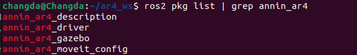
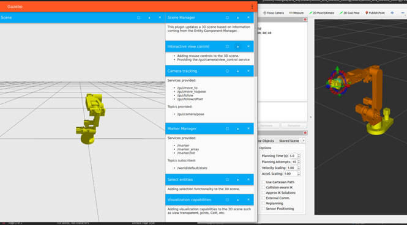
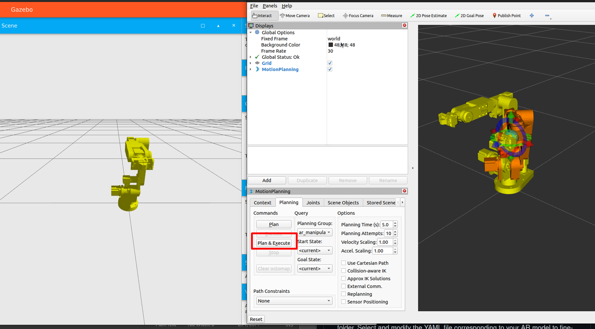

# AR4 Robot Control with Gazebo and MoveIt (ROS2)

---

## **Pipeline Overview**

This tutorial demonstrates how to control the AR4 robot using MoveIt in RViz while running physics simulation in Gazebo. 


---

## **Setup Workspace**

1. Using ROS2 Humble on Ubuntu 22.04, create workspace and clone repository:

      ```
      mkdir -p ~/ar4_ws/src
      cd ~/ar4_ws/src 
      git clone -b humble https://github.com/ycheng517/ar4_ros_driver.git
      cd ..
      ```

2. Install dependencies:

      ```
      sudo apt install python3-rosdep
      sudo rosdep init
      rosdep update
      rosdep install --from-paths . --ignore-src -r -y
      ```

3. Build workspace:

      ```
      cd ~/ar4_ws
      colcon build
      source install/setup.bash
      ```

4. Verify Installation, when you run below, you will see the figure:

      ```
      ros2 pkg list | grep annin_ar4
      ```
      
---

## **Control simulated arm in Gazebo with MoveIt in RViz**

1. Launch Gazebo Simulation
  
      ```
      ros2 launch annin_ar4_gazebo gazebo.launch.py
      ```

2. Launch MoveIt in RViz
     
      Open a new terminal:

      ```
      cd ~/ar4_ws
      source install/setup.bash
      ros2 launch annin_ar4_moveit_config moveit.launch.py use_sim_time:=true include_gripper:=True
      ```
      
      You will see two scenes, one is gazebo (physics simulation), another is rviz (motion planning):
      
      

---

## **Control the Robot in RViz**

1. In rviz graphic interface, use the interactive marker to move the end-effector and click **Plan & Execute** :

       

       
2. Here is the video demo, you will see the simulation in gazebo followed your control in the rviz.

       <p align="center">
       <video controls width="700">
         <source src="/videos/rviz_gazebo.webm" type="video/webm">
       </video>
       </p>


       


