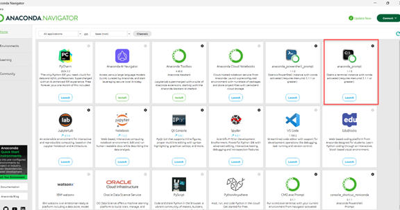
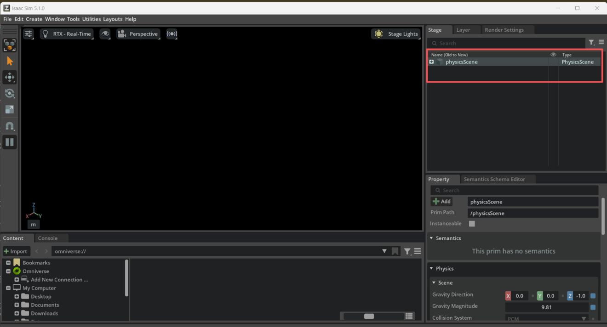
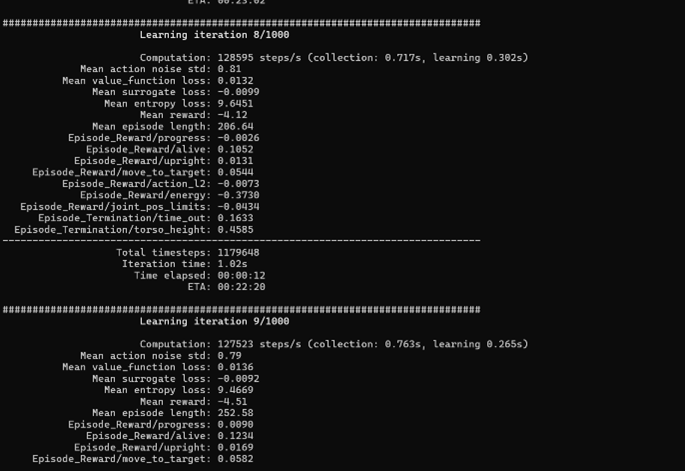
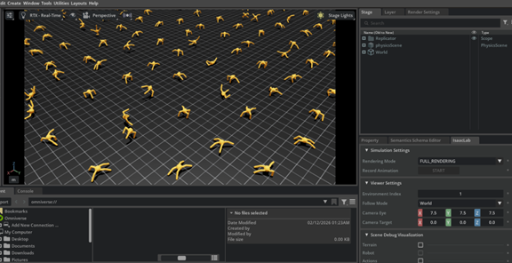

# Windows Installation Guide: Isaac Lab

---

## **What is Isaac Lab?**

1. Please see here: 

  [Isaac Lab Overview](https://isaac-sim.github.io/IsaacLab/main/index.html)


---

## **Create a Conda Environment**

1. Before we install,  we need a virtual environment. The official documentation recommends Miniconda, but installing full Anaconda is also acceptable.

      Download Link: [Anaconda](https://www.anaconda.com/download)

2. After installation, open Anaconda Navigation interface, select **anaconda_prompt**, the UI is shown below:

      

3. Open the terminal, and run

      ```
      conda create -n env_isaaclab python=3.11
      conda activate env_isaaclab
      ```

4. Ensure the latest pip version is installed. To update pip, run the following command from inside the virtual environment:

      ```
      python -m pip install --upgrade pip
      ```

---

## **Install Dependencies**

1. Install Isaac Sim pip packages, run:
  
      ```
      pip install "isaacsim[all,extscache]==5.1.0" --extra-index-url https://pypi.nvidia.com
      ```

2. Install a CUDA-enabled PyTorch build, run:

      ```
      pip install -U torch==2.7.0 torchvision==0.22.0 --index-url https://download.pytorch.org/whl/cu128
      ```

3. Check that the simulator runs as expected, run:

      ```
      Isaacsim
      ```
The successful installation is showing the Isaac Sim UI.

---

## **Install Isaac Lab**

1. Clone the Isaac Lab repository into your project’s workspace:

       ```
       git clone https://github.com/isaac-sim/IsaacLab.git
       ```
       Import Note:

       If you want to clone to another drive , open a separate PowerShell window, switch to that drive first, and input in Terminal, for example:

       ```
       F:
       ```
       Then navigate to the cloned folder, for example:

       ```
       cd isaac\IsaacLab
       ```
       
2. Install Isaac Lab, run:

       ```
       isaaclab.bat --install :: or "isaaclab.bat -i
       ```

---

## **Verifying the Isaac Lab installation**

1. Create Empty in Isaac Sim, run：

       ```
       isaaclab.bat -p scripts\tutorials\00_sim\create_empty.py
       ```
       or 
       
       ```
       python scripts\tutorials\00_sim\create_empty.py
       ```
       
       After running, if you see the figure below, the Isaac Lab is successfully installed:
       
       

2. Train a Robot

       - Install all RL dependencies:
       
       ```
       isaaclab.bat -i all
       ```
       - Train the Ant Robot

       ```
       isaaclab.bat -p scripts/reinforcement_learning/rsl_rl/train.py --task=Isaac-Ant-v0 –headless
       ```
       The learning iteration information is shown below:
       
       

       - If you wanna see GUI, run:
     
              ``` 
              isaaclab.bat -p scripts/reinforcement_learning/rsl_rl/train.py --task=Isaac-Ant-v0 
       ```

       

## **Close Isaac Lab Running**

Unlike the standard way of exiting a terminal with **Ctrl+C**, Isaac Lab must be closed using **Ctrl + Fn + Pause**.


       


