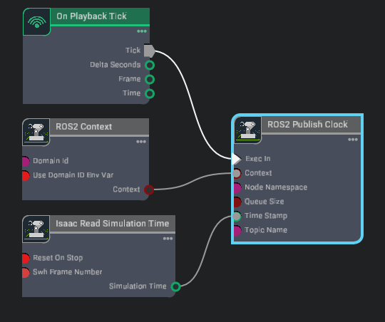
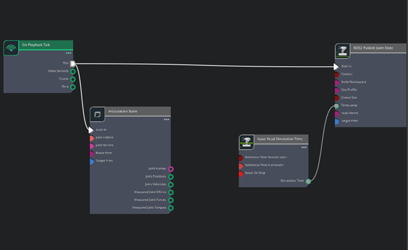
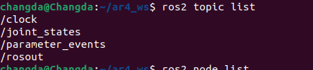
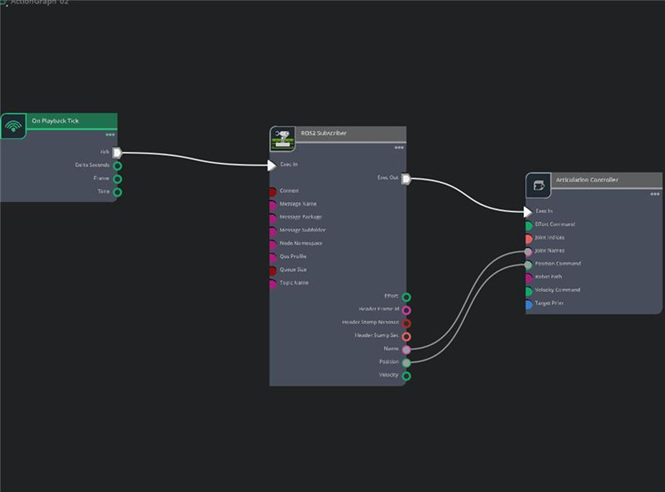

# ROS2–Isaac Sim Integration for AR4 (Linux ↔ Windows)

This tutorial shows how to connect the AR4 robot running in ROS2 on Linux with Isaac Sim running on Windows. After the connection is established, you can control the robot from RViz / MoveIt on Linux and visualize the motion in Isaac Sim on Windows.

---

## **Requirements**

- ROS2 Humble installed on Linux 22.04
- AR4 ROS2 workspace already built on Linux 22.04
- Isaac Sim 5.1 installed on Windows
- AR4 robot model already imported into Isaac Sim
- ROS2 Bridge extension available in Isaac Sim 


---

## **Set ROS domain and DDS configuration**

1. To let Linux ROS2 and Isaac Sim communicate for both Linux and windows machines, make sure both sides use the same:

      - `ROS_DOMAIN_ID`
      - `RMW_IMPLEMENTATION`
      - `ROS_LOCALHOST_ONLY`


2. On Linux:
   
      Open a terminal and run:

      ```
      cd ar4_ws
      source ~/ar4_ws/install/setup.bash
      export ROS_DOMAIN_ID=42
      export RMW_IMPLEMENTATION=rmw_fastrtps_cpp
      export ROS_LOCALHOST_ONLY=0
      ros2 daemon stop
      ros2 daemon start
      ```

3. On Windows:

      Navigate to Isaac Sim installation folder and open a terminal there.  

      ```
      $env:ROS_DOMAIN_ID="42"
      $env:RMW_IMPLEMENTATION="rmw_fastrtps_cpp"
      $env:ROS_LOCALHOST_ONLY="0"

      ```
      To verify, run:
      
      ```
      echo $env:ROS_DOMAIN_ID
      echo $env:RMW_IMPLEMENTATION
      echo $env:ROS_LOCALHOST_ONLY

      ```
      You will see on both Linux and Windows terminals:

      - 42
      - `rmw_fastrips_cpp`
      - `0` 
      
      If so, the basic ROS2 communication is configured correctly.
      (PS: Do not close these terminals after setting the environment variables.)
    

---

## **Connection Verification**

1. Start Isaac Sim with ROS2 Bridge
    
      In the Isaac Sim installation directory on Windows, run:
  
      ```
      .\isaac-sim.bat --/isaac/startup/ros_bridge_extension=isaacsim.ros2.bridge
      ```

      This launches Isaac Sim with the ROS2 Bridge extension enabled.

2. Verify ROS2 connection inside Isaac Sim

      In Isaac Sim:

      - Click `Window` →  `Graph Editor`

       -  Create a new `Action Graph`

      We will build a simple clock publisher graph to verify the connection.
 
      When you open the action graph, add the following nodes:

      - ` On Playback Tick`

      - `ROS2 Context`

      - `Isaac Read Simulation Time`

      - `ROS2 Publish Clock`

      Connect them as shown in figure below.

      

3. Check ROS2 topics on Linux

      Go back to Linux and run in terminal:

      ```
      ros2 node list
      ros2 topic list
      ```
      If `/clock` appears, ROS2 communication between Linux and Isaac Sim is working.

---

## **Joint State Communication**

1. Publish joint states from Isaac Sim

       Next, we publish the AR4 robot joint states from Isaac Sim to ROS2.

       Create a new action graph and add：
        
     - `On Playback Tick`

       - `Articulation State`
  
       - `Isaac Read Simulation Time`

       - `Ros2 Publish Joint State`

       Connect them as shown in Figure below.
 
       

       
2. Configure node properties

       For the `Articulation State` and `ROS2 Publish Joint State` nodes in action graph:

       - Set `targetPrim` to the AR4 articulation root:

       ```
       /World/mk3/base_link
       ```

       - Fill `jointNames` as:
       
       ```
       joint_1
       joint_2
       joint_3
       joint_4
       joint_5
       joint_6
       ```

       After fill out these , return to terminal in Linux and run:

       ```
       ros2 topic list
       ```

       You will see the figure below, demonstrating you communicate successfully.

       

## **Motion Command Pipeline**

1. Prepare trajectory format conversion

      Before subscribing to MoveIt output and sending commands into Isaac Sim, we need to preprocess the trajectory message format.

       Create a new folder under ar4_ws, for example:

       ```
       cd ar4_ws
       mkdir -p tools
       cd tools
       ```
       
       Create a Python script, download the script below and put it into `tools` folder. This script converts MoveIt display trajectory messages into a format that Isaac Sim can subscribe to.

      [relay_display_traj_to_jointstate.py](/files/relay_display_traj_to_jointstate.py)

2. Create the subscriber and articulation controller graph

       Now we create another Action Graph in Isaac Sim for robot control.

       Add:

       - `On Playback Tick`
       
       - `ROS2 Subscriber`

       - ` Articulation Controller`
       
       Connect them as shown in figure below.
     
       


      Configure the ROS2 Subscriber node:

      Set:

      ```
      messagePackage = sensor_msgs
      messageSubfolder = msg
      messageName = JointState
      topicName = /isaac_joint_targets
      ```
      Configure the Articulation Controller node:

      Set targetPrim to:
      
      ```
      /World/mk3/base_link
      ```
3. Run the relay script on Linux

      Back on Linux, go to the tools folder and run in the new terminal base on this folder:
 
      ```
      cd tools
      chmod +x relay_display_traj_to_jointstate.py
      ./relay_display_traj_to_jointstate.py
      ```
4. Launch MoveIt demo on Linux

      Open a new terminal on Linux:

      ```
      cd ar4_ws
      source install/setup.bash
      ros2 launch annin_ar4_moveit_config demo.launch.py ar_model:=mk3
      ```
## **Run the final control loop**

At this stage:

- Isaac Sim should already be open on Windows
- The Action Graph should be running
- The relay script should already be running on Linux
- RViz / MoveIt should already be open on Linux


Now:

- Click `Play` in Isaac Sim
- In RViz, drag the interactive marker, click `Plan & Execute` the motion.

You will see the communication, shown as video below:

<p align="center">
<video controls width="700">
  <source src="https://changdama.github.io/ai_r_lab_tutorial/videos/communication.mp4" type="video/mp4">
</video>
</p>
       


