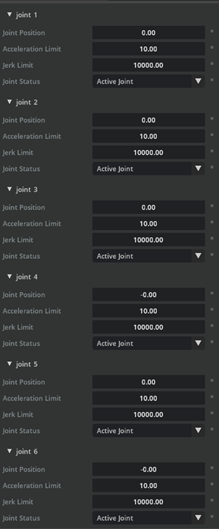
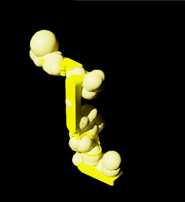
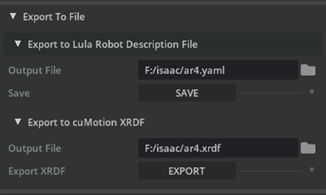

# Isaac Sim Robot Configuration

---

## **Introduction**

After importing the AR4 into Isaac Sim, the robot needs a configuration file before simulation. These configuration files describe the kinematic chain, joint limits, and collision geometry in a form the solvers understand.

This page goes through generating those files for the AR4 using the Lula Robot Description Editor built into Isaac Sim. 


---

## **Prerequisites**

1. The AR4 `.usd` file has been imported into Isaac Sim. See [USD Import in Isaac Sim](#) if you have not done this yet.

2. You have the AR4 URDF file on disk.

3. Articulation root path: /World/ar4_mk3_isaac.


---

## **Enable the Lula Extension**

1. Go to Window → Extensions.
  
2. Type `Lula` in the search box and find **Isaac Sim Lula**.

3. If it does not appear, remove the `@feature` filter.

4. Click **ENABLE**, then check **AUTOLOAD** so it persists across sessions.

---

## **Prepare the AR4 Asset for Lula**

The Lula Robot Description Editor does not support **instantiable** meshes, so before opening the editor we need to flatten them.

1. Open the AR4 USD file in Isaac Sim.
       
2. In the Stage panel, search for `visuals` and select all matching prims.

3. In the **Property** panel, uncheck **Instantiable**.

4. Repeat for all `collisions` prims.

---

## **Configure Joints in the Lula Robot Description Editor**

1. Press **PLAY** to start the simulation. **Keep the simulation running** for the rest of this page. Stopping it will reset the editor and you'll lose your   work.

2. Open **Tools → Lula Robot Description Editor**.

3. In the **Selection Panel**, select the AR4 articulation (`/World/ar4_mk3_isaac`).

4. Scroll to the **Set Joint Properties** section.

5. For each joint, set **Joint Status** as follows:

      | Joint | Joint Status | Notes |
      |---|---|---|
      | `joint_1` … `joint_6` | **Active Joint** | The 6 revolute arm joints driven by the motion solver. |
      | Gripper joint(s) | **Fixed Joint** | Gripper is controlled separately, so Lula treats it as rigid during planning. |

      - Leave the other settings (Joint Position, Acceleration Limit, Jerk Limit) at their defaults unless you have a specific reason to change them. 

      - Here is Joint Properties panel. All six AR4 arm joints are set to Active Joint with default acceleration and jerk limits.

        

---

## **Generate Collision Spheres**

1. Scroll to the **Link Sphere Editor** section.

2. In **Selection Panel → Select link**, pick a link (start with `base_link`, then move down the chain).

3. In **Generate Spheres → Select Mesh**, choose their collision mesh, e.g. `/collisions/base_link/mesh`.

4. Set **Radius Offset** to `0.03`. This pads the sphere radius slightly beyond the mesh to give the solver a safety margin.

5. Set **Number of Spheres** to `8`.

6. Confirm the spheres appear in **red** on the link in the viewport.

7. Click **Generate Spheres**. The spheres turn **yellow** to confirm they're committed.

8. Repeat for all six AR4 arm links plus any gripper links you want considered for collision.



---

## **Export the Configuration Files**

1. Export the Lula Robot Description (YAML)

      - Scroll to the **Export To File** section at the bottom of the editor.

      - Expand **Export to Lula Robot Description File**.

      - Click the file icon and save as `ar4.yaml` somewhere your project can find it.

      - Click **Save**.

      

2. Export the cuMotion XRDF.

     - In the same **Export To File** section, expand **Export to cuMotion XRDF**.

     - Save as `ar4.xrdf`.

     

3. Stop the simulation

---

## **What You Now Have**

After this page you should have:

    ```

    ar4_workspace/
       ├── ar4.urdf              # from the URDF transfer step
       ├── ar4.usd               # from the USD import step
       ├── ar4.yaml              # Lula Robot Description 
       └── ar4.xrdf              # cuMotion XRDF 

   ```

---


       


