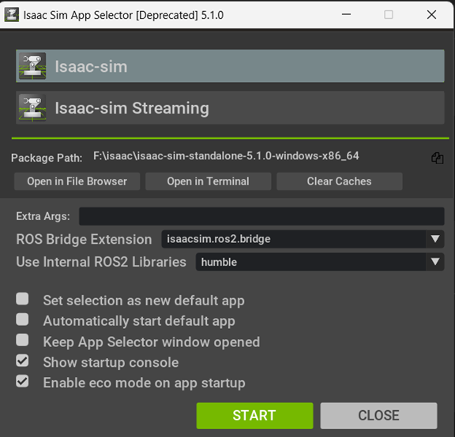
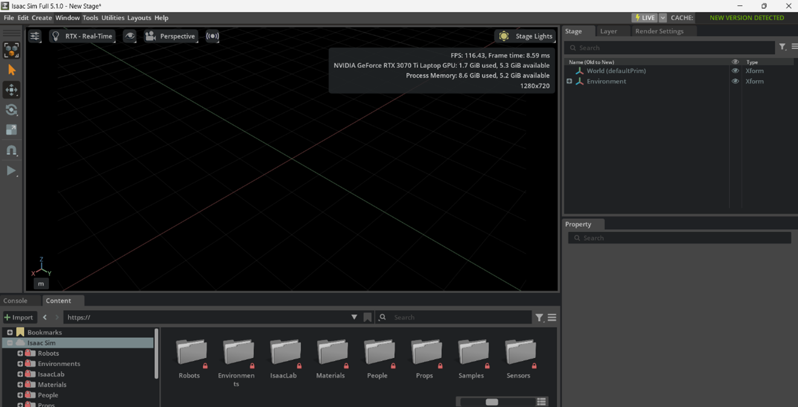
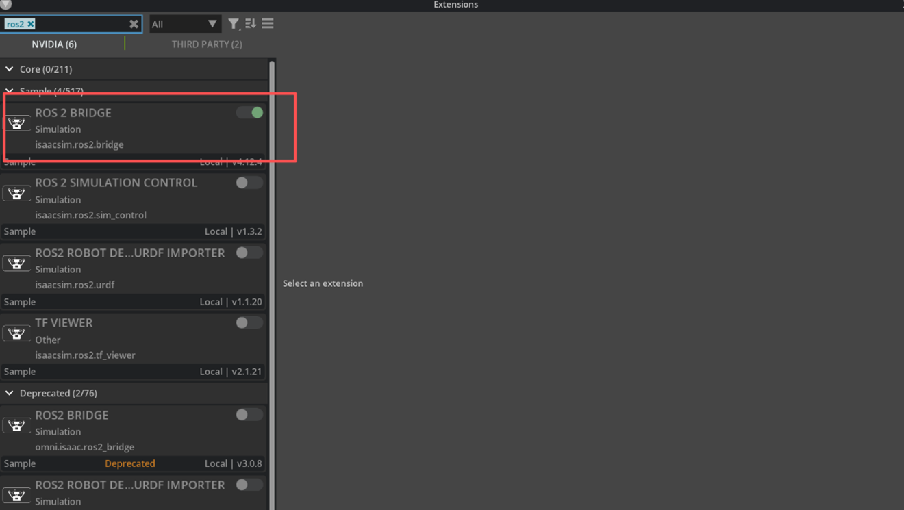

# Windows Installation Guide: Isaac Sim 

---

## **Check Official Documentation**

1. Please refer to the official NVIDIA documentation: 
  [Isaac Sim Installation Guide](https://docs.isaacsim.omniverse.nvidia.com/6.0.0/installation/index.html)

2. At the top of the page, switch the version to **5.1**.

3. Check the hardware requirements.

       Although the official minimum recommendation is:

       - **GeForce RTX 4080**
       - **32GB RAM**
       - **16GB VRAM**

       You can still run Isaac Sim on lower configurations. For example:

       - **GeForce RTX 3070**
       - **32GB RAM**
       - **8GB VRAM**

       This is the minimum workable configuration. It may run slower, but it is usable.

       If your computer cannot meet the minimum requirements, consider cloud deployment:

       [Isaac Sim Cloud Deployment](https://docs.isaacsim.omniverse.nvidia.com/6.0.0/installation/install_cloud.html)

---

## **Download Isaac Sim Installation Package**

1. From the left menu, click **Download Isaac Sim**

2. Select **Windows**

      **Important Notes**

      - Do NOT install Isaac Sim WebRTC Streaming Client, this is only for browser-based remote streaming from a server.

      - Isaac Sim Assets: If your configuration is strong (RTX 4080, 32GB RAM, 16GB VRAM), you may download them as tutorial assets. For minimum configuration machines, I do not recommend    installing them.

3. The installation package size is approximately **7.3GB**. Please be patient.

---

## **Install Isaac Sim**

After downloading the installation package:

1. Create a folder (example):
  
      ```
      C:\isaac
      ```

2. Unzip the package into that folder and navigate into the folder and run:

      ```
      post_install.bat
      isaac-sim.selector.bat
      ```

3. If installation is successful, you should see:

      ```
      [140.262s] app ready
      [256.161s] Isaac Sim Full App is loaded.
      ```

---

## Configure ROS Bridge (Required)

1. Double-click:
       ```
       isaac-sim.selector.bat
       ```
2. Add ROS Bridge Extension:

       ```
       isaacsim.ros2.bridge
       ```

This is required to connect Isaac Sim to a robot’s ROS2 system running on Linux.

(For detailed steps, see the ROS–Isaac Connection Tutorial.)

3. In the dropdown **Use Internal ROS2 Libraries**, select:
       ```
       humble
       ```
4. Enable only:

       - Show startup console
       - Enable eco mode on app startup

The reference picture is shown below:



After you set up, you will see the picture below, which demonstrates that you are successfully installed Isaac Sim.



5. Verify extension:
       - Click **Window → Extensions**
       - Search **ROS2 Bridge**
       - Enable it

The extension setting is shown in the picture below:



If everything is correct, Isaac Sim is successfully installed.


